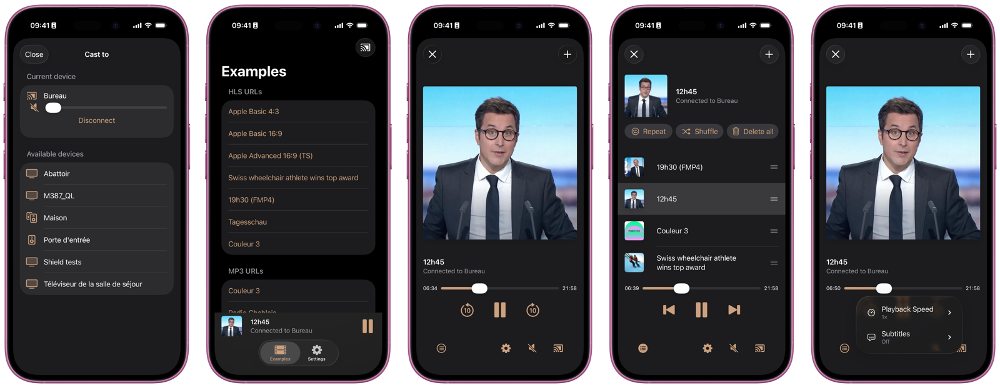

<!-- markdownlint-disable-next-line MD041 -->
[](https://github.com/SRGSSR/castor)

# Overview

[](https://swiftpackageindex.com/SRGSSR/castor) [](https://swiftpackageindex.com/SRGSSR/castor) [](https://swift.org/package-manager) [](LICENSE) [](https://testflight.apple.com/join/3DMfy33Y)

Castor is an SDK for easy [Google Cast](https://developers.google.com/cast) integration in iOS applications.

# Features

- Ready-made standard player, mini player, and device selection views for effortless integration.
- First-class integration with SwiftUI for effortless custom view integration.
- APIs for device discovery and playback management, focusing on fast and responsive UI updates.
- Built-in support for transitions between local and remote playback.
- Playlist management.
- Support for alternative audio tracks and subtitles.
- Volume management.
- Metadata support.
- Animated Cast button and icon.
- Playback speed controls.
- Looping playback.

# Showcase

[](https://github.com/SRGSSR/castor)

From left to right:

- Screenshot 1: Standard device selection view.
- Screenshot 2: Standard mini player view.
- Screenshots 3, 4 and 5: Standard player view, including playlist management and playback settings menu.

# Compatibility

The library is suitable for applications running on iOS 16 and above.

# Integration

The library can be integrated using [Swift Package Manager](https://swift.org/package-manager) directly [within Xcode](https://developer.apple.com/documentation/xcode/adding_package_dependencies_to_your_app). You can also declare the library as a dependency of another one directly in the associated `Package.swift` manifest.

# Documentation

Castor documentation includes articles, tutorials and an API reference to help you learn more about available features and how to integrate them into your application.

> [!TIP]
> If you discover errors in the documentation or if some documentation is missing please file a dedicated [issue](https://github.com/SRGSSR/castor/issues/new/choose). You can also directly submit documentation improvements via [pull requests](https://github.com/SRGSSR/castor/compare).

## DocC documentation

Documentation is available as a [DocC](https://developer.apple.com/documentation/docc) documentation catalog. This catalog must be built by opening the project with Xcode and selecting _Product_ > _Build Documentation_. You can then access it right from within the Xcode documentation window.

## Online documentation

Documentation for Castor can also be found online on [Swift Package Index](https://swiftpackageindex.com/SRGSSR/castor/documentation/castor).

> [!TIP]
> Documentation available from the above link opens for the latest tag. Use Swift Package Index navigation top bar to quickly switch to another tag or `main`.

## Miscellaneous documentation

Further documentation is also available by following the links below:

- [Known issues](docs/KNOWN_ISSUES.md)
- [Continuous integration](docs/CONTINUOUS_INTEGRATION.md)

# Plugins

The package provides a single plugin which automatically inserts correct versioning information into binaries. This plugin must be trusted interactively when a project integrating Castor is built using Xcode for the first time.

On a continuous integration server you must trust plugins automatically by setting an appropriate default:

```shell
defaults write com.apple.dt.Xcode IDESkipPackagePluginFingerprintValidatation -bool YES
```

If you are using Xcode Cloud this can be achieved with a [custom build script](https://developer.apple.com/documentation/xcode/writing-custom-build-scripts).

If your project is built with `xcodebuild` directly the same effect can be achieved by passing the `-skipPackagePluginValidation` option.

> [!IMPORTANT]
> Build services such as GitHub Actions, Bitrise, CircleCI, and Travis CI often provide caching mechanisms to accelerate CI/CD pipelines, including caching Swift package sources. Castor leverages Git tags from its package repository to automatically determine the correct version. However, this process depends on having up-to-date local tags, which may not be guaranteed when a package cache is used.
>
> To ensure accuracy and reliability, we recommend performing clean builds when delivering your application via a delivery pipeline. Caches can still be utilized for routine continuous integration tasks to save time during development.

# Contributing

If you want to contribute to the project have a look at our [contributing guide](docs/CONTRIBUTING.md).

# License

See the [LICENSE](LICENSE) file for more information.
